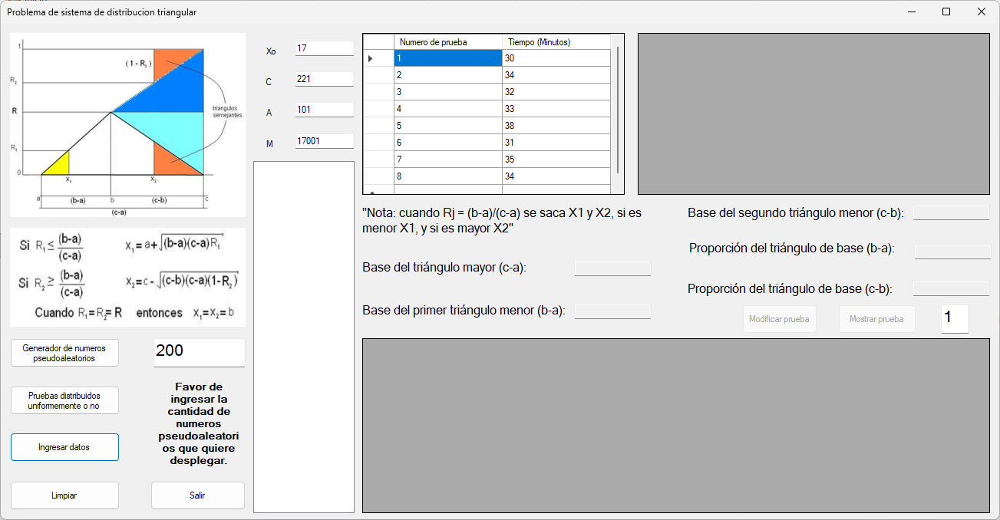

# 🧮 Proyecto distribución tríangular

Este proyecto es una aplicación que resuelva algun problema de 1 o más distribuciones de probabilidad tríangular. 

---

## 📷 Captura del Programa

---

## 🛠 Tecnologías usadas

- C# (.NET Framework)
- Windows Forms

---

## 🚀 Cómo ejecutar

1. Abre el proyecto con Visual Studio
2. Compila y ejecuta (F5)
3. Formulas un problema, luego recolectas datos, formulas modelos matemáticos.

---

## ✍️ Autor

- Carlos Alberto Medina Beltran
